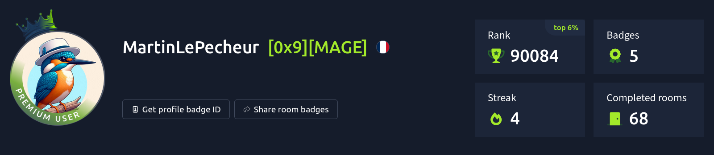
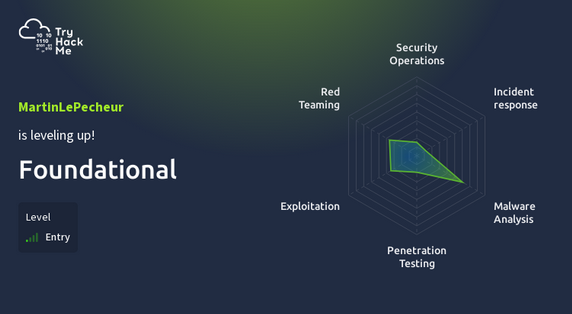
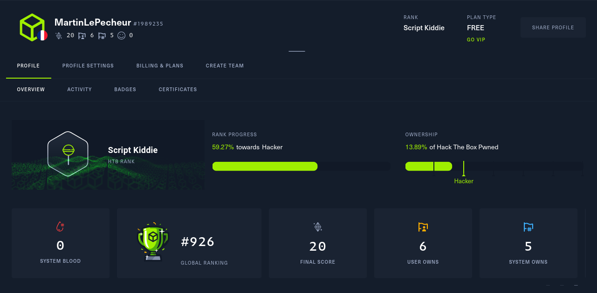
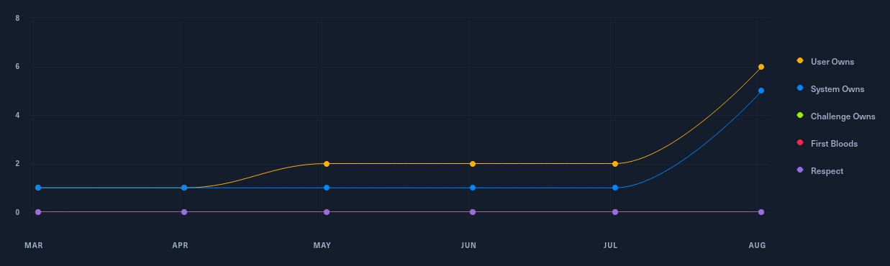
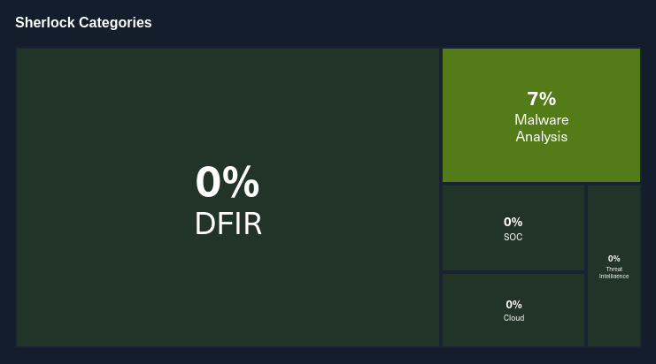

# 💫 About Me:

Graduate of INSA Lyon, I'm driven by an insatiable curiosity for **reverse engineering**, meticulously dissecting binaries and probing systems to understand their inner workings at the most fundamental level. My true passion, however, lies in the intricate art of **malware analysis**. I thrive on deconstructing malicious code, uncovering its hidden functionalities, command-and-control mechanisms, and evasive techniques. This deep dive into the adversarial mindset is continuously sharpened through the rigorous and practical challenges presented by platforms like Hack The Box (HTB) and TryHackMe (THM), where I apply and refine my skills in understanding, exploiting, and ultimately defending against sophisticated threats.

# 💻 Tech Stack:

[TryHackMe](https://tryhackme.com/p/MartinLePecheur)

[HackTheBox](https://app.hackthebox.com/profile/1989235)

